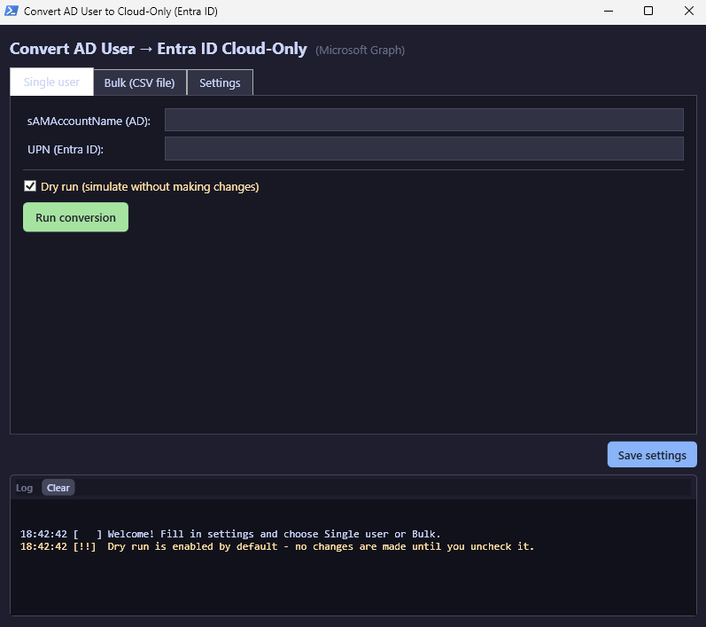

# Convert AD Users to Cloud-Only (Entra ID)

A Windows PowerShell 5.1 WPF GUI tool for converting AD-synced users into standalone cloud accounts in Entra ID (Azure AD).

Available in **English** ([`En/`](En/)) and **Swedish** ([`Sv/`](Sv/)).



## What it does

For each user, the tool performs these steps:

1. Moves the AD account to a non-synced OU (with XML backup of all attributes)
2. Runs a delta sync via the Azure AD Connect server — the account is soft-deleted in Entra ID
3. Pauses the sync schedule
4. Restores the account in Entra ID from the deleted items
5. Clears `onPremisesImmutableId` via Microsoft Graph (handles federated domains automatically)
6. Re-enables the sync schedule and runs a new delta sync

The result is a standalone cloud-only account no longer linked to on-premises AD.

## Features

- **Single user** and **Bulk (CSV)** modes
- **Dry run** mode enabled by default — nothing is changed until you uncheck it
- Per-user XML backup of AD attributes before move
- Catppuccin dark-themed WPF UI
- Persistent settings in `Convert-to-CloudOnly-Settings.json`
- Works on both internet-connected and air-gapped servers (offline package flow)
- Robust matching of deleted Entra users (handles soft-delete UPN mangling, federated domains, local-part matching)

## Requirements

- Windows PowerShell 5.1 (run as administrator)
- RSAT: Active Directory DS Tools
- Microsoft.Graph PowerShell modules (Authentication, Users, Identity.DirectoryManagement)
- Network access (WinRM) to the Azure AD Connect server
- Entra ID role: User Administrator or Global Administrator
- AD permission to move users between OUs

## Quick start

1. Pick your language folder: [`En/`](En/) or [`Sv/`](Sv/)
2. Right-click `Install-Prerequisites.ps1` → **Run as administrator** (once per server)
3. Right-click `Launch-GUI.bat` → **Run as administrator**
4. Configure the **Settings** tab (target OU, AAD Connect server, managed domain suffix, log folder)
5. Use the **Single user** or **Bulk (CSV file)** tab to run conversions

See [`En/README.txt`](En/README.txt) or [`Sv/README.txt`](Sv/README.txt) for full documentation.

## Air-gapped / offline networks

1. On an internet-connected machine, run `Download-Prerequisites.ps1` — creates an `Offline-Packages\` folder with NuGet provider, PowerShellGet and all Microsoft.Graph modules.
2. Copy the folder to the target server.
3. Run `Install-Prerequisites.ps1` on the target — it detects `Offline-Packages\` and installs from it.

## Repository layout

```
Convert-to-cloud-only/
├── En/                              English version
│   ├── Convert-to-CloudOnly-GUI.ps1
│   ├── Install-Prerequisites.ps1
│   ├── Download-Prerequisites.ps1
│   ├── Launch-GUI.bat
│   ├── README.txt
│   └── example-users.csv
├── Sv/                              Swedish version
│   ├── Convert-to-CloudOnly-GUI.ps1
│   ├── Install-Prerequisites.ps1
│   ├── Download-Prerequisites.ps1
│   ├── Launch-GUI.bat
│   ├── README.txt
│   └── example-users.csv
├── LICENSE
└── README.md
```

## License

MIT — see [LICENSE](LICENSE).
